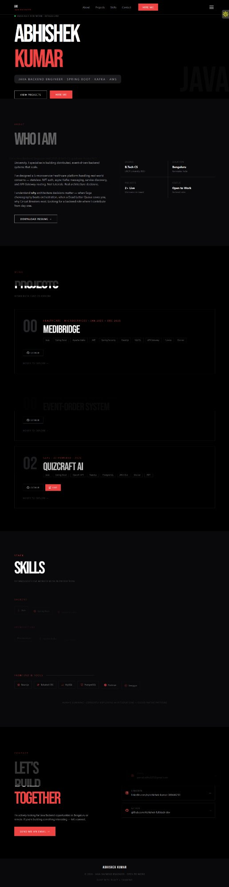

# 🧑‍💻 Abhishek Kumar — Developer Portfolio

<div align="center">

[](https://abhishekkumar-dev.vercel.app)
[](https://react.dev)
[](https://tailwindcss.com)
[](https://vercel.com)

*Personal portfolio of a Java Backend Engineer — showcasing live projects, skills, and experience.*

</div>

---

## 📸 Preview



---

## ✨ Sections

- **Hero** — Animated entrance with name, title, and CTA buttons
- **About** — Bio, education (B.Tech CS), location, and open to work status
- **Projects** — MediBridge, Event-Order System, QuizCraft AI with live links
- **Skills** — Full tech stack with icons (Java, Spring Boot, Kafka, AWS, Docker...)
- **Contact** — Email, LinkedIn, GitHub

---

## 🚀 Projects Featured

**MediBridge** — Healthcare Microservices Platform
`Java · Spring Boot · Kafka · JWT · MySQL · Docker · AWS EC2`
[GitHub →](https://github.com/Abhishek-fullstack-dev/medibridge-fullstack-microservices)

**Event-Order System** — Distributed Order Processing
`Java · Spring Boot · Kafka · AWS EC2 · Docker · GitHub Actions`
[GitHub →](https://github.com/Abhishek-fullstack-dev/event-order-system)

**QuizCraft AI** — Live AI-Powered Quiz SaaS
`Java · Spring Boot · OpenAI API · PostgreSQL · AWS EC2 · React.js`
[GitHub →](https://github.com/Abhishek-fullstack-dev/quizcraft-ai) · [Live →](https://quizcraft.live)

---

## 🛠️ Tech Stack

| Layer | Technology |
|---|---|
| **UI** | React.js, Vite, Tailwind CSS |
| **Animations** | Framer Motion |
| **Deployment** | Vercel |

---

## ⚙️ Run Locally

```bash
git clone https://github.com/Abhishek-fullstack-dev/abhishek-portfolio.git
cd abhishek-portfolio
npm install
npm run dev
```

---

## 👤 Contact

- 📧 parvatiabhu620@gmail.com
- 💼 [linkedin.com/in/abhishek-kumar-380446233](https://linkedin.com/in/abhishek-kumar-380446233)
- 🐙 [github.com/Abhishek-fullstack-dev](https://github.com/Abhishek-fullstack-dev)

---

<div align="center"><i>Java Backend Engineer — building scalable systems and shipping real products.</i></div>
