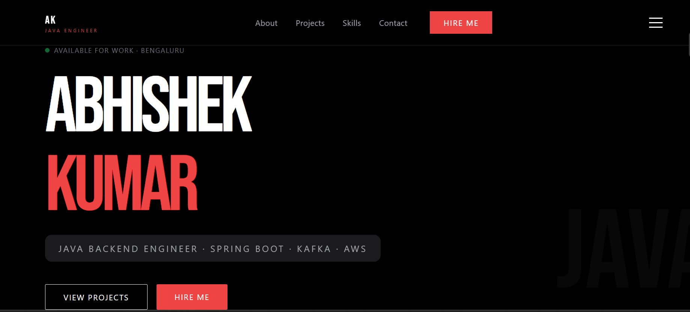
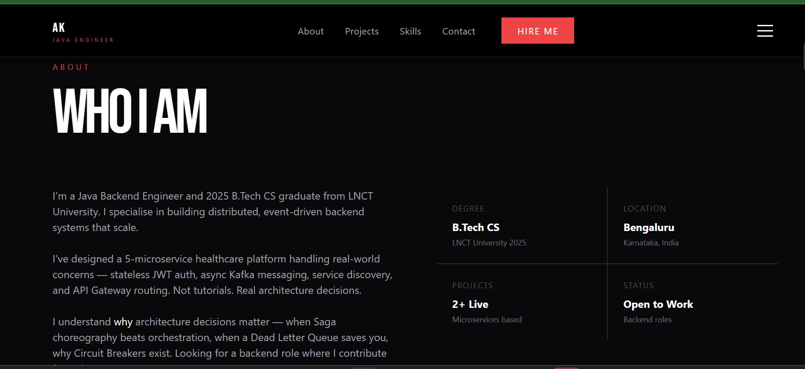
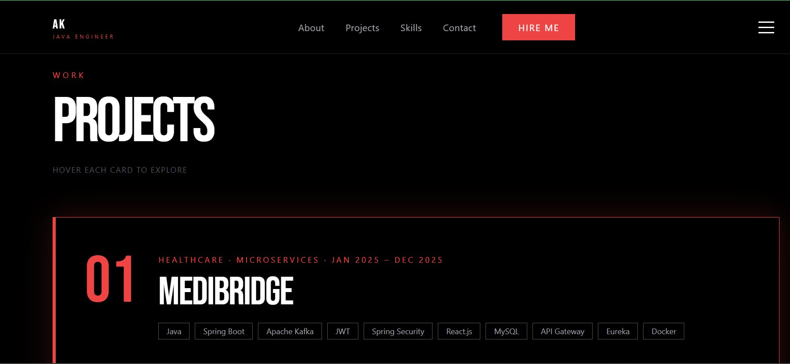
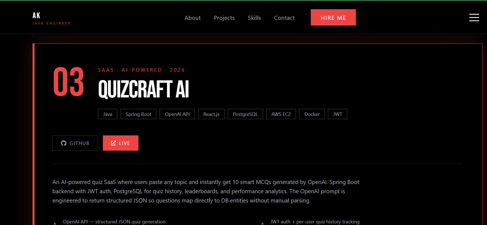
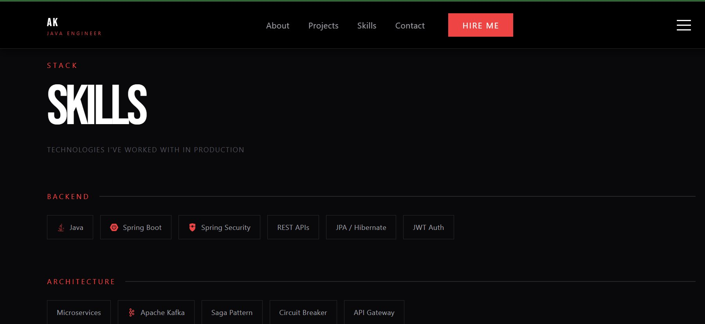
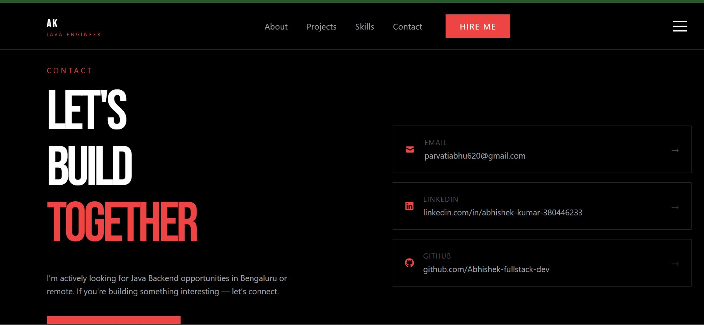
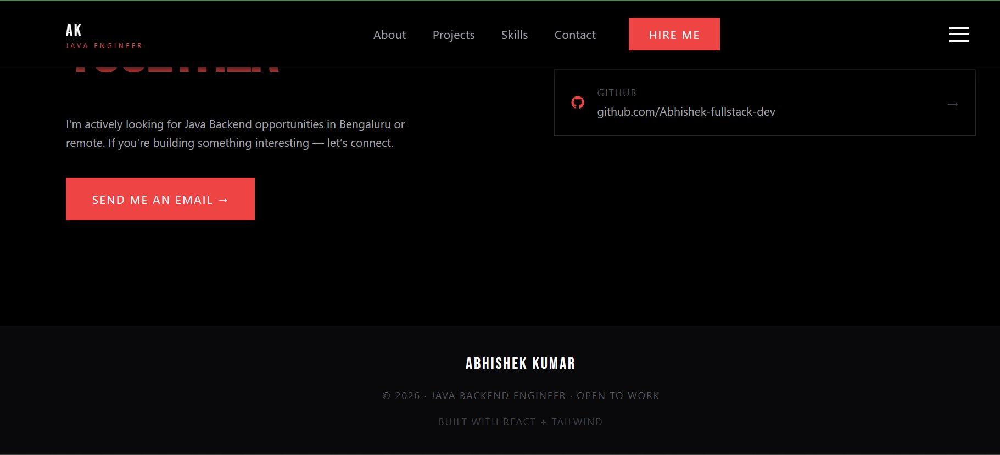

# 🧑‍💻 Abhishek Kumar — Java Backend Engineer Portfolio

<div align="center">

[](https://abhishekkumar-dev.vercel.app)
[](https://react.dev)
[](https://tailwindcss.com)
[](https://www.framer.com/motion)
[](https://vercel.com)

*Personal portfolio of a Java Backend Engineer — showcasing live projects, architecture decisions, and production experience.*

</div>

---

## 📸 Screenshots

<table>
  <tr>
    <td></td>
    <td></td>
  </tr>
  <tr>
    <td align="center"><b>Hero — Available for Work · Bengaluru</b></td>
    <td align="center"><b>About — Who I Am</b></td>
  </tr>
  <tr>
    <td></td>
    <td></td>
  </tr>
  <tr>
    <td align="center"><b>Projects Section</b></td>
    <td align="center"><b>QuizCraft AI — Live SaaS</b></td>
  </tr>
  <tr>
    <td></td>
    <td></td>
  </tr>
  <tr>
    <td align="center"><b>Skills — Technologies in Production</b></td>
    <td align="center"><b>Contact — Let's Build Together</b></td>
  </tr>
</table>


<p align="center"><b>Footer — © 2026 · Java Backend Engineer · Open to Work</b></p>

---

## ✨ Sections

- **Hero** — Animated entrance, Available for Work badge, Hire Me CTA
- **About** — Bio, B.Tech CS (LNCT 2025), Bengaluru, 2+ live projects, Open to Work
- **Projects** — MediBridge, Event-Order System, QuizCraft AI with tech tags and live links
- **Skills** — Backend, Architecture, Cloud/DevOps, Database, Frontend & Tools
- **Contact** — Email, LinkedIn, GitHub with "Send me an email" CTA

---

## 🚀 Projects Featured

**01 · MediBridge** — Healthcare Microservices Platform
`Java · Spring Boot · Apache Kafka · JWT · Spring Security · React.js · MySQL · API Gateway · Eureka · Docker`
[GitHub →](https://github.com/Abhishek-fullstack-dev/medibridge-fullstack-microservices)

**02 · Event-Order System** — Distributed Order Processing
`Java · Spring Boot · Apache Kafka · AWS EC2 · Docker · GitHub Actions`
[GitHub →](https://github.com/Abhishek-fullstack-dev/event-order-system)

**03 · QuizCraft AI** — Live AI-Powered Quiz SaaS
`Java · Spring Boot · OpenAI API · React.js · PostgreSQL · AWS EC2 · Docker · JWT`
[GitHub →](https://github.com/Abhishek-fullstack-dev/quizcraft-ai) · [Live →](https://quizcraft.live)

---

## 🛠️ Built With

| Layer | Technology |
|---|---|
| **UI** | React.js, Vite |
| **Styling** | Tailwind CSS |
| **Animations** | Framer Motion |
| **Deployment** | Vercel |

---

## ⚙️ Run Locally

```bash
git clone https://github.com/Abhishek-fullstack-dev/abhishek-portfolio.git
cd abhishek-portfolio
npm install
npm run dev
```

---

## 👤 Contact

- 📧 parvatiabhu620@gmail.com
- 💼 [linkedin.com/in/abhishek-kumar-380446233](https://linkedin.com/in/abhishek-kumar-380446233)
- 🐙 [github.com/Abhishek-fullstack-dev](https://github.com/Abhishek-fullstack-dev)

---

<div align="center"><i>© 2026 · Java Backend Engineer · Open to Work · Built with React + Tailwind</i></div>
